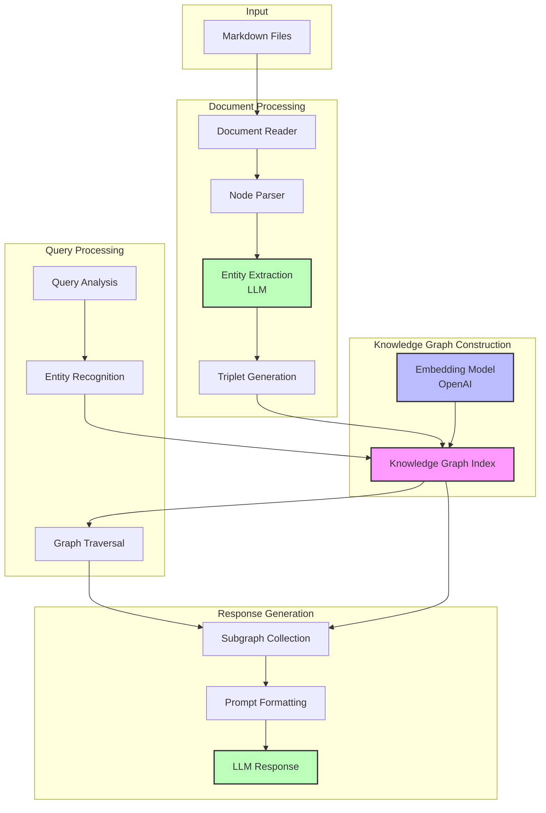

# GraphRAG Architecture

## Overview

GraphRAG combines knowledge graph construction with retrieval-augmented generation (RAG) to create an intelligent system for querying and exploring document relationships. The system processes markdown documents to build a knowledge graph, which can then be queried using natural language.

## System Components

### 1. Document Processing & Entity Extraction
- Documents are loaded using `SimpleDirectoryReader`
- `SimpleNodeParser` splits documents into manageable chunks
- LLM performs:
  - Entity identification within chunks
  - Relationship extraction between entities
  - Triplet generation (subject, predicate, object)

### 2. Knowledge Graph Construction
- `KnowledgeGraphIndex` creates a NetworkX graph from extracted triplets
- Nodes represent entities from the documents
- Edges represent relationships with predicates as relationship types
- Original context is preserved in node metadata
- Node embeddings assist in relationship identification during construction

### 3. Embedding Layer
- OpenAI's embedding model generates vector representations for nodes
- Embeddings are used during graph construction to:
  - Help identify potential relationships
  - Support entity disambiguation
  - Enhance relationship extraction

### 4. Query Processing
- Analyzes input questions for entity mentions
- Uses graph-based retrieval:
  - Identifies mentioned entities
  - Traverses graph to find connected nodes
  - Scores relevance based on graph structure

### 5. Response Generation
- Collects relevant nodes and relationships from graph traversal
- Formats subgraph information into LLM prompt
- Generates natural language response using:
  - Original question
  - Retrieved subgraph
  - Associated document context

## Architecture Diagram

## Data Flow

1. **Input Stage**
   - Markdown files are loaded into the system
   - Documents are split into manageable chunks

2. **Processing Stage**
   - Entities and relationships are extracted
   - Node embeddings are generated
   - Knowledge graph is constructed using both explicit relationships and embedding-assisted relationship identification

3. **Query Stage**
   - User submits natural language query
   - Query is analyzed for entities
   - Graph is traversed to find relevant subgraph

4. **Response Stage**
   - Subgraph is formatted into prompt
   - LLM generates natural language response
   - Results are displayed with visualization

## Performance Considerations

- Embedding generation is computationally intensive but only needed during graph construction
- Initial graph construction requires multiple API calls for:
  - Entity extraction
  - Relationship identification
  - Embedding generation
- Query processing uses efficient graph traversal algorithms
- Response generation is optimized for context relevance

## Future Enhancements

The system has been enhanced with temporal knowledge graph capabilities, which are documented in detail in [TKG.md](TKG.md). This includes:

- Document date tracking and temporal metadata
- Age-based weighting for both visualization and query relevance
- Foundation for future temporal reasoning capabilities

For more information about the temporal knowledge graph implementation and roadmap, see [TKG.md](TKG.md).
