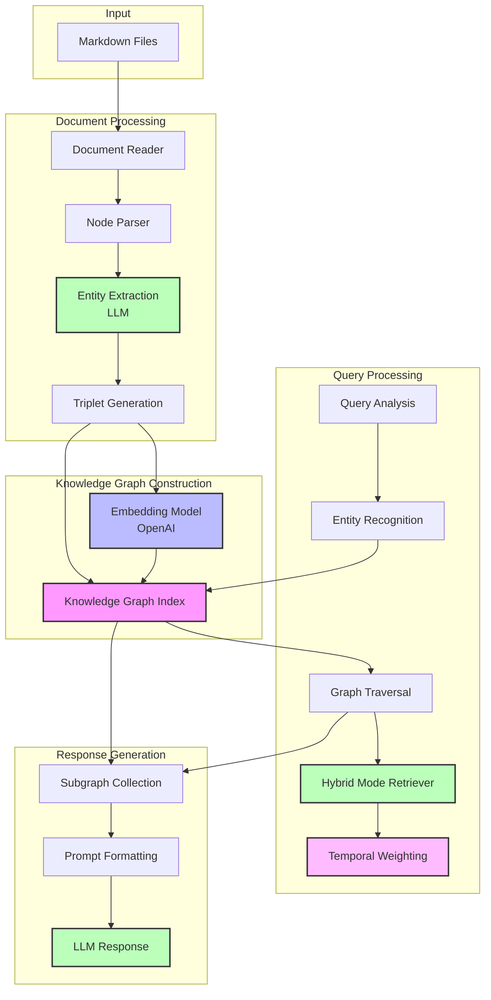

# GraphRAG Architecture

## Overview

GraphRAG combines knowledge graph construction with retrieval-augmented generation (RAG) to create an intelligent system for querying and exploring document relationships. The system processes markdown documents to build a knowledge graph, which can then be queried using natural language.

## System Components

### 1. Document Processing & Entity Extraction
- Documents are loaded using `SimpleDirectoryReader`
- `SimpleNodeParser` splits documents into manageable chunks
- LLM performs:
  - Entity identification within chunks
  - Relationship extraction between entities
  - Triplet generation (subject, predicate, object)

### 2. Knowledge Graph Construction

The knowledge graph is constructed using the following process:

1. **Document Processing**: Each markdown document is processed and split into chunks
2. **Triplet Extraction**: The LLM extracts subject-predicate-object triplets from each chunk using a prompt template
3. **Graph Construction**: The triplets are used to build the graph structure, with nodes representing entities and edges representing relationships
4. **Temporal Metadata**: Each node is associated with its document's ingestion date
5. **Semantic Embeddings**: Each triplet is embedded using OpenAI's embedding model
   - These embeddings enable semantic search during query time
   - They are not used in graph construction, but are crucial for retrieval

### 3. Query Processing

Queries are processed using:
1. **Initial Retrieval** (Hybrid Mode):
   - **Keyword Matching**: Finds triplets containing exact matches to query terms
   - **Semantic Search**: Uses triplet embeddings to find semantically similar relationships
   - The system automatically combines both approaches when embeddings are available
   
2. **Temporal Weighting**:
   - Retrieved nodes are scored based on their document age
   - More recent documents receive higher weights
   - Our custom `TemporalResponseSynthesizer` applies this weighting

3. **Response Generation**:
   - The LLM generates a natural language response using:
     - The retrieved graph context
     - The original query
     - The temporal relevance scores

### 4. Response Generation
- Collects relevant nodes and relationships from graph traversal
- Formats subgraph information into LLM prompt
- Generates natural language response using:
  - Original question
  - Retrieved subgraph
  - Associated document context

## Architecture Diagram

## Data Flow

1. **Input Stage**
   - Markdown files are loaded into the system
   - Documents are split into manageable chunks

2. **Processing Stage**
   - Entities and relationships are extracted
   - Knowledge graph is constructed using both explicit relationships and temporal metadata
   - Triplets are embedded for semantic search

3. **Query Stage**
   - User submits natural language query
   - Query is analyzed for entities
   - Graph is traversed to find relevant subgraph using hybrid retrieval

4. **Response Stage**
   - Subgraph is formatted into prompt
   - LLM generates natural language response
   - Results are displayed with visualization

## Performance Considerations

- Initial graph construction requires multiple API calls for:
  - Entity extraction
  - Relationship identification
  - Embedding generation
- Query processing uses efficient graph traversal algorithms
- Response generation is optimized for context relevance

## Future Enhancements

The system has been enhanced with temporal knowledge graph capabilities, which are documented in detail in [TKG.md](TKG.md). This includes:

- Document date tracking and temporal metadata
- Age-based weighting for both visualization and query relevance
- Foundation for future temporal reasoning capabilities

For more information about the temporal knowledge graph implementation and roadmap, see [TKG.md](TKG.md).
