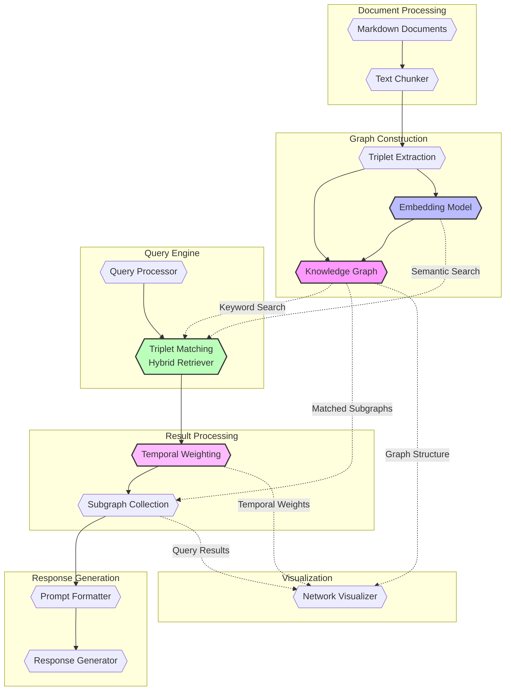

# GraphRAG Architecture

## Overview

GraphRAG combines knowledge graph construction with retrieval-augmented generation (RAG) to create an intelligent system for querying and exploring document relationships. The system processes markdown documents to build a knowledge graph, which can then be queried using natural language.

## System Architecture

### 1. Document Processing
Documents go through a multi-stage processing pipeline:

1. **Text Chunking**:
   - Documents are split into chunks of 1024 tokens
   - Adjacent chunks overlap by 128 tokens to maintain context
   - This chunking ensures each piece is small enough for LLM processing
   - Overlap helps capture relationships that span chunk boundaries

2. **Triplet Extraction**:
   - Each chunk is processed independently 
   - The system extracts subject-predicate-object triplets
   - Number of triplets varies based on content density
   - Only explicitly stated relationships are extracted

3. **Embedding Generation**:
   - Each extracted triplet gets its own embedding vector
   - These embeddings enable semantic search during query time
   - Embeddings are generated in parallel for efficiency

### 2. Knowledge Graph Construction
The knowledge graph is constructed using a multi-step process:

1. **Node Creation**: 
   - Nodes are created from triplet subjects and objects
   - Each node maintains links to its source chunks
   - Nodes inherit temporal metadata from source documents

2. **Edge Creation**:
   - Edges represent predicates (relationships)
   - Multiple edges can exist between the same nodes
   - Edges maintain provenance information

3. **Semantic Layer**:
   - Each triplet's embedding is stored
   - Enables semantic similarity search
   - Used in hybrid retrieval during queries

### 3. Query Processing
Queries are processed through a three-stage pipeline:

1. **Initial Retrieval** (Hybrid Mode):
   - **Keyword Search**: Finds triplets containing exact matches to query terms in subject, predicate, or object
   - **Semantic Search**: Uses triplet embeddings to find conceptually related relationships
   - Results from both approaches are combined for comprehensive retrieval

2. **Result Processing**:
   - Retrieved triplets are weighted based on document age
   - More recent documents receive higher weights
   - Relevant subgraphs are collected based on weighted results

3. **Response Generation**:
   - The system generates a natural language response using:
     - The retrieved graph context
     - The original query
     - The temporal relevance scores

### 4. Visualization
- Interactive network graph 
- Node opacity reflects document age
- Query-relevant nodes are highlighted
- Edges show relationship types

## Component Interactions

## Data Flow

1. **Ingestion Stage**
   - Documents are loaded with temporal metadata
   - Text is split into overlapping chunks
   - Each chunk is processed for triplet extraction
   - Triplets are embedded in parallel

2. **Processing Stage**
   - Knowledge graph is constructed from triplets
   - Each triplet is associated with:
     - Semantic embedding for similarity search
     - Temporal metadata for recency weighting
     - Source chunk information for context

3. **Query Stage**
   - User submits natural language query
   - System performs hybrid retrieval:
     - Keyword matching for exact matches
     - Embedding similarity for semantic matches
   - Results are weighted by temporal relevance
   - System generates final response

## Performance Considerations

1. **Chunking Strategy**:
   - 1024 token chunks balance context size and processing efficiency
   - 128 token overlap preserves cross-chunk relationships
   - Larger chunks mean fewer API calls but more context per call

2. **Parallel Processing**:
   - Triplet extraction runs in parallel across chunks
   - Embedding generation is parallelized
   - Uses thread pool for I/O-bound operations

3. **API Optimization**:
   - Retry logic handles rate limits
   - Exponential backoff prevents API flooding
   - Parallel processing respects API constraints

4. **Memory Usage**:
   - Embeddings stored for each triplet
   - Graph structure maintains relationships
   - Source chunks preserved for context

## Future Enhancements

The system has been enhanced with temporal knowledge graph capabilities, which are documented in detail in [TKG.md](TKG.md). This includes:

- Document date tracking and temporal metadata
- Age-based weighting for both visualization and query relevance
- Foundation for future temporal reasoning capabilities

For more information about the temporal knowledge graph implementation and roadmap, see [TKG.md](TKG.md).
